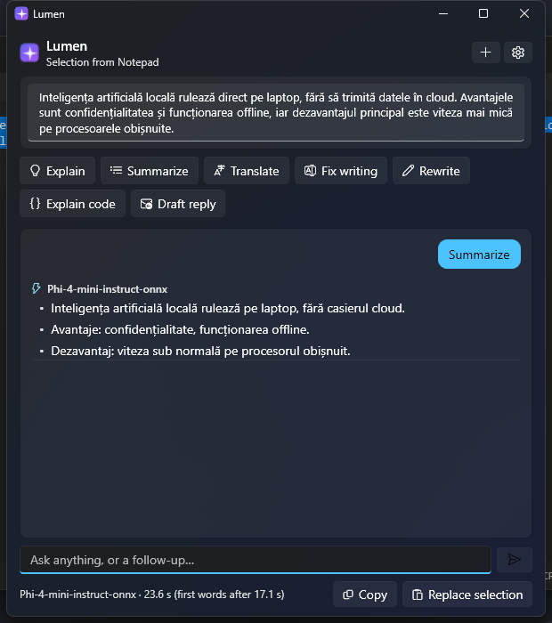
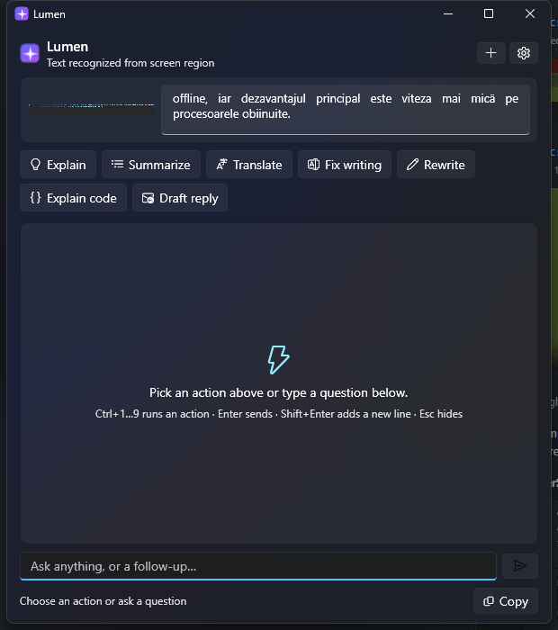
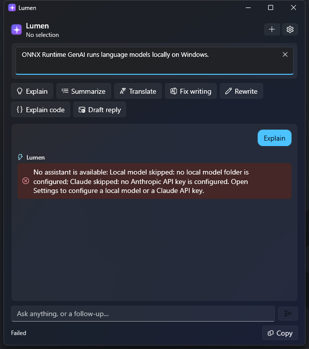
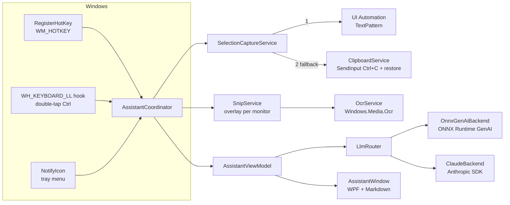

<p align="center">
  
</p>

<h1 align="center">Lumen</h1>

<p align="center">
  <b>A native Windows AI assistant that lives in the system tray.</b><br/>
  Select text anywhere (or a region of the screen), press a hotkey, and ask a local model, or Claude, about it.
</p>

<p align="center">
  
  
  
  
  
  
</p>

---

## Contents

1. [What Lumen does](#what-lumen-does)
2. [Screenshots](#screenshots)
3. [Quick start](#quick-start)
4. [Using Lumen](#using-lumen)
5. [Architecture](#architecture)
6. [How each part works](#how-each-part-works)
7. [Configuration reference](#configuration-reference)
8. [Tests](#tests)
9. [Building a release and the installer](#building-a-release-and-the-installer)
10. [GPU acceleration](#gpu-acceleration)
11. [Troubleshooting](#troubleshooting)
12. [Privacy](#privacy)
13. [Publishing this project to GitHub](#publishing-this-project-to-github)
14. [Ideas for later](#ideas-for-later)

---

## What Lumen does

| | |
|---|---|
| **Global hotkey** | `Ctrl+Shift+Space` in any application reads the current selection and opens the assistant next to the mouse cursor. |
| **Screen OCR** | `Ctrl+Alt+Shift+S` freezes the screen, lets you drag a rectangle, and reads its text with the OCR engine built into Windows. |
| **Double-tap Ctrl** (optional) | A low-level keyboard hook opens the assistant when you tap `Ctrl` twice. |
| **Local inference** | Runs a small language model (Phi-4-mini, Qwen 2.5, Llama 3.2, Gemma…) on your PC with ONNX Runtime GenAI. Private, free, offline. |
| **Claude fallback** | When the local model is missing, fails, or the text is too long, the request goes to Claude (or the other way round, or only one of them: your choice). |
| **Quick actions** | Explain, Summarize, Translate, Fix writing, Rewrite, Explain code, Draft reply, plus your own actions defined in `settings.json`. |
| **Follow-up chat** | Keep asking questions about the same text; the conversation keeps its context. |
| **Replace selection** | Paste the answer back into the original application in place of the selected text (great after *Fix writing* or *Translate*). |
| **Native feel** | Windows 11 Fluent theme (light/dark follows Windows), Per-Monitor DPI aware, tray icon and menu, single instance, start with Windows, per-user installer. |

## Screenshots

| Local answer for text selected in Notepad | Text read from a screen region (OCR) | No assistant configured yet |
|---|---|---|
|  |  |  |

The first screenshot is a real run: the selection was read through UI Automation in 56 ms, and Phi-4-mini answered on the CPU.

## Quick start

### Requirements

* Windows 10 version 2004 (build 19041) or newer, or Windows 11, x64.
* [.NET 9 SDK](https://dotnet.microsoft.com/download/dotnet/9.0) to build (`dotnet --version` should print 9.x).
* About 5 GB of disk and 8 GB of RAM for the recommended local model (optional: you can use Claude only).
* An [Anthropic API key](https://platform.claude.com/settings/keys) for Claude (optional: you can use the local model only).

### 1. Build and run

```powershell
git clone https://github.com/YOUR-USERNAME/Lumen.git
cd Lumen
dotnet build
dotnet run --project src/Lumen.App
```

On the first run Lumen shows a tray notification and opens **Settings**, because no assistant is configured yet.

### 2. Get a local model (optional, recommended)

```powershell
powershell -ExecutionPolicy Bypass -File scripts/download-model.ps1
```

This downloads `microsoft/Phi-4-mini-instruct-onnx`, CPU int4 variant (4.7 GB), into
`%LOCALAPPDATA%\Lumen\models\…` using only `curl.exe`, and prints the folder path. In
**Settings → Local model**, paste that folder (or use *Browse…*) and click **Test local model**.

Any model exported for ONNX Runtime GenAI works: its folder must contain `genai_config.json`.
Lumen detects the chat template (Phi, Llama 3, ChatML/Qwen, Gemma) from the model type automatically.

### 3. Add a Claude API key (optional)

In **Settings → Claude**, paste your key and click **Test Claude**. The key is encrypted with
Windows DPAPI before it is written to disk. Alternatively, set the `ANTHROPIC_API_KEY` environment variable.

### 4. Use it

Select text in any application and press `Ctrl+Shift+Space`.

## Using Lumen

### Shortcuts

| Where | Keys | Action |
|---|---|---|
| Anywhere | `Ctrl+Shift+Space` | Ask about the selected text (configurable) |
| Anywhere | `Ctrl+Alt+Shift+S` | Read a screen region with OCR (configurable) |
| Anywhere | `Ctrl`, `Ctrl` | Ask about the selection (if enabled in Settings) |
| Assistant | `Ctrl+1` … `Ctrl+9` | Run quick action 1…9 |
| Assistant | `Enter` / `Shift+Enter` | Send / new line |
| Assistant | `Esc` | Stop the answer, or hide the window |
| Assistant | `Ctrl+Shift+C` | Copy the answer |
| Assistant | `Ctrl+R` | Replace the original selection with the answer |
| Assistant | `Ctrl+N` | New conversation |
| Overlay | `Esc` / right click | Cancel the screen capture |

### Tray menu

Left click opens the assistant. Right click: *Ask about selection*, *Read screen region*, *Assistant ▸*
(routing mode), *Settings…*, *Open logs folder*, *Exit Lumen*.

### Routing modes

| Mode | Order | Use it when |
|---|---|---|
| `LocalFirst` (default) | local → Claude | You want privacy and zero cost, with Claude as a safety net. |
| `CloudFirst` | Claude → local | You want the best answers, and the local model when offline. |
| `LocalOnly` | local | Nothing may leave the PC. |
| `CloudOnly` | Claude | You have no local model or a slow PC. |

The local model is skipped automatically when the text clearly does not fit its context window.

## Architecture



### Solution layout

```
Lumen/
├── Lumen.sln
├── Directory.Build.props          shared compiler settings (nullable, analyzers, warnings as errors)
├── src/
│   ├── Lumen.Core/                UI-free logic, net9.0, fully unit-tested
│   │   ├── Chat/                  ChatMessage, Conversation (append-only)
│   │   ├── Input/                 HotkeyGesture parsing, DoubleTapDetector
│   │   ├── Llm/
│   │   │   ├── ILlmBackend.cs     the streaming backend contract
│   │   │   ├── LlmRouter.cs       backend choice + fallback, emits RouterEvents
│   │   │   ├── Local/             OnnxGenAiBackend, ChatTemplates, StopSequenceDetector
│   │   │   └── Claude/            ClaudeBackend (Anthropic .NET SDK)
│   │   ├── Prompts/               QuickActions, CapturedContext, PromptBuilder
│   │   ├── Settings/              AppSettings, SettingsStore (atomic JSON), ISecretProtector
│   │   └── Text/                  MarkdownParser (streaming-tolerant)
│   └── Lumen.App/                 WPF app, net9.0-windows10.0.19041.0
│       ├── App.xaml(.cs)          entry point, dependency injection, global error handling
│       ├── Interop/               NativeMethods: [LibraryImport] Win32 declarations
│       ├── Services/              hotkeys, keyboard hook, clipboard, selection, OCR,
│       │                          screen capture, snip overlay, tray icon, coordinator
│       ├── Infrastructure/        DPAPI, autostart, single instance, file logger, window helpers
│       ├── ViewModels/            MVVM with CommunityToolkit.Mvvm source generators
│       ├── Views/                 AssistantWindow, SettingsWindow, SnipOverlayWindow
│       ├── Controls/              Markdown → FlowDocument, hotkey recorder
│       └── app.manifest           Per-Monitor V2 DPI awareness, asInvoker
├── tests/Lumen.Core.Tests/        103 xUnit v3 tests
├── installer/Lumen.iss            Inno Setup script (per-user, no admin)
├── scripts/                       publish.ps1, download-model.ps1, make-icon.ps1
└── .github/workflows/ci.yml       build + test on every push; release zip on tags
```

**Why two projects?** `Lumen.Core` contains everything that does not need a window: it targets plain
`net9.0`, has no WPF dependency, and is covered by unit tests that run anywhere. `Lumen.App` is the thin
Windows-specific shell around it.

### Dependencies

| Package | Why |
|---|---|
| `Microsoft.ML.OnnxRuntimeGenAI` | Local LLM inference (tokenizer, KV cache, sampling, ONNX Runtime). |
| `Anthropic` | Official Claude SDK for .NET: typed requests, streaming, retries, typed errors. |
| `CommunityToolkit.Mvvm` | `[ObservableProperty]` / `[RelayCommand]` source generators: MVVM without boilerplate. |
| `Microsoft.Extensions.DependencyInjection` / `.Logging` | Constructor injection and structured logging, the standard .NET way. |
| `System.Security.Cryptography.ProtectedData` | DPAPI encryption of the API key. |
| `xunit.v3` | Tests. |

Everything else (OCR, UI Automation, hotkeys, clipboard, DPI) is Windows itself.

## How each part works

This section is a guided tour of the interesting code. File links point to the implementation.

### 1. Global hotkeys: `RegisterHotKey`

[`HotkeyService`](src/Lumen.App/Services/HotkeyService.cs) asks Windows to post `WM_HOTKEY` to a window
of ours when a key combination is pressed anywhere. The receiving window is a **message-only window**
(`HWND_MESSAGE` parent): invisible, not in the taskbar or Alt+Tab, created with WPF's `HwndSource`.

* `MOD_NOREPEAT` stops auto-repeat from firing the hotkey many times while it is held.
* If another program already owns the combination, `RegisterHotKey` fails with error 1409 and Lumen
  tells you in a tray notification instead of silently not working.
* Shortcuts are stored as readable text (`"Ctrl+Shift+Space"`) and parsed by
  [`HotkeyGesture`](src/Lumen.Core/Input/HotkeyGesture.cs), whose modifier flags have exactly the Win32
  `MOD_*` values.
* While the Settings window is open, the hotkeys are released so the shortcut boxes can record them.

### 2. Low-level keyboard hook: `WH_KEYBOARD_LL`

[`LowLevelKeyboardHook`](src/Lumen.App/Services/LowLevelKeyboardHook.cs) sees every key press in the session,
which is what "double-tap Ctrl" needs. The rules for doing that safely are all in the code:

* The callback is a static method marked `[UnmanagedCallersOnly]` and passed to Windows as a
  **function pointer** (`delegate* unmanaged`). No delegate exists that the garbage collector could free
  while Windows still calls it (a classic source of random crashes with hooks).
* The callback only updates a few integers in [`DoubleTapDetector`](src/Lumen.Core/Input/DoubleTapDetector.cs)
  and posts real work to the Dispatcher: Windows silently removes hooks that take too long.
* Events flagged `LLKHF_INJECTED` (synthetic input, including Lumen's own Ctrl+C) are ignored.
* No exception may escape into native code; `CallNextHookEx` is always called.
* It is **off by default** and installed only when you enable it.

### 3. Reading the selection: UI Automation, then the clipboard

[`SelectionCaptureService`](src/Lumen.App/Services/SelectionCaptureService.cs):

1. **UI Automation** (the accessibility API screen readers use): `AutomationElement.FocusedElement` →
   `TextPattern.GetSelection()`. Works in Notepad, Word, browsers, Windows Terminal, most modern apps, and
   never touches the clipboard. It runs on a background thread with a 700 ms timeout, because it talks to
   the other process over COM and a hung app must not freeze Lumen.
2. **Simulated Ctrl+C** in [`ClipboardService`](src/Lumen.App/Services/ClipboardService.cs) when UI
   Automation finds nothing:
   * wait until you release the hotkey's modifiers (a held Shift would turn Ctrl+C into Ctrl+Shift+C);
   * snapshot **every format** on the clipboard (text, images, files…);
   * send Ctrl+C with `SendInput` and wait for `GetClipboardSequenceNumber()` to change, so we know exactly
     when the application has copied;
   * read the text and restore the original clipboard;
   * retry automatically on `CLIPBRD_E_CANT_OPEN` (another process holding the clipboard for a few ms).
3. **Terminals are excluded** from the Ctrl+C fallback: there, Ctrl+C would interrupt the running program.

"Replace selection" uses the same machinery in reverse: put the answer on the clipboard, activate the original
window, send Ctrl+V, wait for the paste, restore the clipboard.

### 4. Screen capture and OCR

* [`ScreenCaptureService`](src/Lumen.App/Services/ScreenCaptureService.cs) copies every monitor with GDI
  `CopyFromScreen` **before** the overlay appears, so the overlay shows a frozen image.
* [`SnipOverlayWindow`](src/Lumen.App/Views/SnipOverlayWindow.xaml.cs) is created once per monitor. It is
  moved onto its monitor in physical pixels with `SetWindowPos` and then maximized, which is robust even with
  several monitors at different scaling. The selected rectangle is converted to pixels as a *fraction* of the
  window size, so DPI never matters.
* [`OcrService`](src/Lumen.App/Services/OcrService.cs) uses `Windows.Media.Ocr`, the engine built into
  Windows (WinRT, called directly thanks to the `net9.0-windows10.0.19041.0` target). Small crops are upscaled
  up to 3× first: OCR accuracy drops sharply on tiny glyphs.
* With *Send screenshots* enabled, Claude also receives the image itself, so it can read charts and layouts
  that OCR text alone loses.

### 5. DPI awareness

[`app.manifest`](src/Lumen.App/app.manifest) declares **Per-Monitor V2**. Without it Windows would scale
Lumen's windows as bitmaps and report virtualized coordinates on 125 %/150 % displays, and the screenshot
selection would be offset. With it, cursor positions, `Screen.Bounds` and screenshots all use real pixels.

### 6. Local inference with ONNX Runtime GenAI

[`OnnxGenAiBackend`](src/Lumen.Core/Llm/Local/OnnxGenAiBackend.cs):

```csharp
using var config = new Config(modelFolder);             // reads genai_config.json
var model = new Model(config);
var tokenizer = new Tokenizer(model);

using Sequences tokens = tokenizer.Encode(prompt);
using var parameters = new GeneratorParams(model);
parameters.SetSearchOption("max_length", promptTokens + maxAnswerTokens);
using var generator = new Generator(model, parameters);
generator.AppendTokenSequences(tokens);                 // "prefill": process the prompt
using var stream = tokenizer.CreateStream();
while (!generator.IsDone())
{
    generator.GenerateNextToken();                      // one forward pass + sampling
    string piece = stream.Decode(generator.GetNextTokens()[0]);
    // → hand the piece to the UI
}
```

What the real implementation adds around that loop:

* **Chat templates.** A local model reads one string, not a list of messages, and each family was trained
  on a specific format with special tokens.
  [`ChatTemplates`](src/Lumen.Core/Llm/Local/ChatTemplates.cs) renders Phi-3/4, Llama 3, ChatML (Qwen and
  many others) and Gemma, chosen automatically from `model.GetModelType()`.
* **Incremental decoding.** `TokenizerStream` decodes token by token correctly even when one character
  (`ș`, `ț`, emoji) spans several tokens.
* **Stop markers** split across tokens are caught by
  [`StopSequenceDetector`](src/Lumen.Core/Llm/Local/StopSequenceDetector.cs), which holds back only the
  text that could still become a marker.
* **Threading.** The blocking loop runs on its own thread (`TaskCreationOptions.LongRunning`) and pushes
  pieces into a `Channel<string>`; `StreamAsync` reads the channel with `await foreach`. The UI thread never blocks.
* **Lifetime.** The model loads lazily on first use (≈11 s for Phi-4-mini on a laptop CPU), is optionally
  preloaded at startup, and is unloaded after an idle period to give back several GB of RAM. A
  `SemaphoreSlim(1,1)` guarantees one generation at a time and that the model is never disposed mid-generation.
* **Context guard.** Prompts that leave no room for the answer throw `ContextTooLongException`, which the
  router turns into a fallback to Claude.

Measured on the development laptop (CPU only, Phi-4-mini int4): ≈4 tokens/s. A GPU makes it several times faster (see below).

### 7. Claude through the Anthropic .NET SDK

[`ClaudeBackend`](src/Lumen.Core/Llm/Claude/ClaudeBackend.cs) streams from `client.Beta.Messages.CreateStreaming`:

* Default model **`claude-opus-5-5`**, with **effort `low`**: for a hotkey assistant, the time to the
  first word matters most. Raise it in Settings for harder questions.
* **Server-side refusal fallbacks** (`fallbacks: "default"`, beta `server-side-fallback-2026-07-01`):
  if Claude's safety classifiers decline a request, the API retries it on a recommended fallback model
  inside the same call. Only sent to models that support it.
* **Prompt caching**: the constant system prompt carries `cache_control`, so follow-up questions re-read it
  from the cache.
* The **stop reason is checked before trusting the content**: a refusal is an HTTP 200, not an exception;
  `max_tokens` adds a visible "answer cut off" note.
* SDK exceptions are caught **most specific first** (`401`, `403`, `404`, `429`, other `400`, `5xx`,
  network) and turned into messages a user can act on.
* Screenshots are sent as an image content block before the text that refers to them.

### 8. The router

[`LlmRouter`](src/Lumen.Core/Llm/LlmRouter.cs) does not return plain text but a stream of typed events:

```csharp
public abstract record RouterEvent;
public sealed record BackendStarted(BackendKind Backend, string DisplayName, string? Note) : RouterEvent;
public sealed record TextDelta(string Text) : RouterEvent;
public sealed record FallingBack(BackendKind From, string Reason, bool DiscardPartialOutput) : RouterEvent;
public sealed record Completed(BackendKind Backend, TimeSpan Elapsed, TimeSpan? TimeToFirstText, int Characters) : RouterEvent;
```

So the UI can show *who* is answering and *why* it switched, and clear a half-written local answer when
Claude takes over mid-stream. User cancellation is never treated as a failure. The ViewModel consumes it with
a pattern-matching `switch` inside `await foreach`.

### 9. Application structure

* **Dependency injection** in [`App.xaml.cs`](src/Lumen.App/App.xaml.cs) is the only place that knows
  concrete types. Disposing the container at exit disposes the tray icon, hotkeys, hook, model and HTTP client.
* **MVVM** with CommunityToolkit.Mvvm: `[ObservableProperty]` fields and `[RelayCommand]` methods are
  expanded by source generators at compile time.
* **Single instance**: a named `Mutex` detects a running Lumen; a named `EventWaitHandle` lets a second
  launch ask the first one to show its window ([`SingleInstanceGuard`](src/Lumen.App/Infrastructure/SingleInstanceGuard.cs)).
* **Fluent theme**: `ThemeMode="System"` (.NET 9) styles every control like Windows 11 and follows light/dark mode.
* **Markdown**: answers are parsed by a small streaming-tolerant parser in Core and rendered into a WPF
  `FlowDocument`; re-renders are coalesced at `DispatcherPriority.Background` so fast token streams stay smooth.
* **Settings** are JSON with source-generated serialization, written atomically (temp file + move); a corrupt
  file is backed up and replaced with defaults.
* **Secrets**: the API key is encrypted with **DPAPI** for the current Windows user (plus app-specific entropy).
* **Logging** goes to `%LOCALAPPDATA%\Lumen\logs` through a background `Channel`, 7 days retention.
* **Resilience**: UI-thread exceptions are logged and shown as a notification instead of closing a tray app.
* **Code quality**: nullable reference types, `latest-recommended` analyzers and `TreatWarningsAsErrors`
  across the whole solution. The build has zero warnings.

## Configuration reference

Settings live in `%APPDATA%\Lumen\settings.json`. Most are editable in the Settings window; the file can also
be edited by hand (Settings → About → *Open settings.json*), then restart Lumen.

```jsonc
{
  "hotkeys": { "ask": "Ctrl+Shift+Space", "snip": "Ctrl+Alt+Shift+S", "doubleTapCtrl": false },
  "routingMode": "LocalFirst",               // LocalFirst | CloudFirst | LocalOnly | CloudOnly
  "local": {
    "modelPath": "C:\\Users\\you\\AppData\\Local\\Lumen\\models\\Phi-4-mini-instruct-onnx\\cpu_and_mobile\\cpu-int4-rtn-block-32-acc-level-4",
    "promptFormat": "Auto",                  // Auto | Phi3 | Llama3 | ChatML | Gemma
    "maxContextTokens": 4096,
    "maxOutputTokens": 1024,
    "temperature": 0.3,
    "topP": 0.9,
    "preloadOnStartup": false,
    "unloadAfterIdleMinutes": 15
  },
  "claude": {
    "model": "claude-opus-5-5",
    "effort": "low",                         // "" omits it (for models without effort support)
    "maxOutputTokens": 8000,
    "protectedApiKey": "AQAAANCMnd8B…",      // DPAPI-encrypted, set from the Settings window
    "useServerSideFallbacks": true,
    "sendScreenshots": true
  },
  "capture": {
    "useClipboardFallback": true,
    "clipboardFallbackExcludedProcesses": ["WindowsTerminal", "conhost", "cmd", "powershell", "pwsh"],
    "ocrLanguage": "",                       // "" = Windows display languages, or e.g. "ro-RO"
    "maxCapturedChars": 60000
  },
  "general": { "startWithWindows": false, "hideOnDeactivate": false, "alwaysOnTop": true, "preferredLanguage": "Romanian" },
  "customActions": [
    { "id": "eli5", "label": "ELI5", "instruction": "Explain this like I am five, in {language}.", "icon": "\uE8BD" },
    { "id": "tests", "label": "Write tests", "instruction": "Write xUnit tests for this C# code.", "icon": "\uE9D5" }
  ]
}
```

`{language}` in an instruction is replaced with `preferredLanguage`. Icons are
[Segoe Fluent Icons](https://learn.microsoft.com/windows/apps/design/style/segoe-fluent-icons-font) code points.

## Tests

```powershell
dotnet test
```

103 tests cover the parts where bugs hide: every chat template, split stop markers, hotkey parsing and
canonical formatting, double-tap timing, the Markdown parser on incomplete input, conversation rules, prompt
building and escaping, settings persistence (round trip, corrupt file, clamping, encrypted key), the Claude
request shape, and the router's fallback behavior using scriptable fake backends.

## Building a release and the installer

```powershell
# Optional, once: the installer compiler
winget install JRSoftware.InnoSetup

powershell -ExecutionPolicy Bypass -File scripts/publish.ps1 -Version 1.0.0
```

The script runs the tests, publishes a **self-contained** build (the .NET runtime is included, so users install
nothing else) with **ReadyToRun** (precompiled code, faster startup), and writes to `artifacts/`:

* `Lumen-1.0.0-win-x64-portable.zip`: unzip anywhere and run `Lumen.exe`;
* `Lumen-1.0.0-win-x64-setup.exe` (when Inno Setup is installed): a per-user installer into
  `%LOCALAPPDATA%\Programs\Lumen`, no administrator rights, Start menu shortcut, optional autostart,
  clean uninstall. During an upgrade it detects a running Lumen and asks to close it first.

Models are not bundled; they are downloaded separately.

## GPU acceleration

The default package (`Microsoft.ML.OnnxRuntimeGenAI`) runs on the CPU. For a GPU:

1. Replace the package in `src/Lumen.Core/Lumen.Core.csproj` with `Microsoft.ML.OnnxRuntimeGenAI.DirectML`
   (any DirectX 12 GPU: NVIDIA, AMD, Intel) or `Microsoft.ML.OnnxRuntimeGenAI.Cuda` (NVIDIA).
2. Download the matching model variant, for example:
   ```powershell
   powershell -ExecutionPolicy Bypass -File scripts/download-model.ps1 -Variant gpu/gpu-int4-rtn-block-32
   ```
3. Point Settings → Local model at the new folder. The execution provider comes from that folder's
   `genai_config.json`, so no code changes are needed.

Note: the GPU packages are released on their own schedule and can be a few versions behind the CPU package;
if the API differs, the compiler will point at the lines to adjust.

## Troubleshooting

| Symptom | Fix |
|---|---|
| "Could not register Ctrl+Shift+Space" | Another app owns that shortcut. Pick another one in Settings. |
| The hotkey does nothing in one particular app | That app runs as administrator. Windows does not let a normal app read or send keys to elevated windows. Run Lumen elevated too, or avoid elevating the app. |
| The selection is empty in some app | It exposes no UI Automation text and ignores Ctrl+C. Copy the text yourself and paste it into the Lumen window. |
| OCR misses diacritics (ș, ț, ă) | Add the language in Windows Settings → Time & language → Language & region (with OCR/"optical character recognition" feature), then pick it in Settings → Capture. |
| The first local answer is slow | The model loads on first use (≈10 s). Enable *Load the model when Lumen starts*. |
| Local answers are slow | CPU inference of a 3.8B model is a few tokens per second. Use a GPU variant, a smaller model (Qwen2.5-1.5B), or `CloudFirst`. |
| "The Anthropic API key was rejected" | Re-enter the key in Settings → Claude and click *Test Claude*. |
| Anything else | Tray → *Open logs folder*: every capture, routing decision and error is logged there. |

## Privacy

* In `LocalOnly` mode nothing leaves your computer.
* In the other modes, text (and screenshots, if enabled) is sent to the Anthropic API only for requests
  that Claude answers. The log files never contain captured text, only sizes and timings.
* The keyboard hook (off by default) only counts Ctrl taps; it stores nothing.
* The API key is encrypted with DPAPI and is useless on another account or machine.

## Publishing this project to GitHub

From the repository folder (`Lumen/`, where `Lumen.sln` is):

**1. Create the local repository and the first commit**

```powershell
git init -b main
git add .
git status            # check: no bin/, obj/, artifacts/ or model files should be listed
git commit -m "Lumen: native Windows AI assistant (WPF, ONNX Runtime GenAI, Claude)"
```

`.gitignore` already excludes build output and `artifacts/`; models live outside the repository.

**2. Create an empty repository on GitHub**

On <https://github.com/new>: name it `Lumen`, choose Public or Private, and **do not** add a README,
.gitignore or license (they already exist here). Click *Create repository*.

**3. Connect and push**

```powershell
git remote add origin https://github.com/YOUR-USERNAME/Lumen.git
git push -u origin main
```

Git opens a browser window to sign in the first time (Git Credential Manager comes with Git for Windows).

**4. After the push**

* Replace `YOUR-USERNAME` in this README and in `installer/Lumen.iss`, then commit and push again.
* The *Actions* tab shows the CI workflow building and testing the project.
* To publish a release with the portable zip attached:
  ```powershell
  git tag v1.0.0
  git push origin v1.0.0
  ```
  GitHub Actions builds `Lumen-1.0.0-win-x64-portable.zip` and attaches it to a new release. You can upload
  the setup `.exe` built locally to the same release by editing it on GitHub.
* Optional: add topics such as `csharp`, `wpf`, `windows`, `onnxruntime`, `llm`, `claude`, `ocr` on the
  repository page.

With the GitHub CLI (`winget install GitHub.cli`), steps 2 and 3 are one command:
`gh repo create Lumen --public --source . --push`.

## Ideas for later

* Voice input with `Windows.Media.SpeechRecognition`.
* Phi-3.5-vision / Phi-4-multimodal locally so the local model can see screenshots too.
* Tool use: let Claude call functions that read files or open URLs.
* MSIX packaging and code signing.
* NPU acceleration through the Windows ML execution providers on Copilot+ PCs.

## License

[MIT](LICENSE) © 2026 Iustin Prodan
